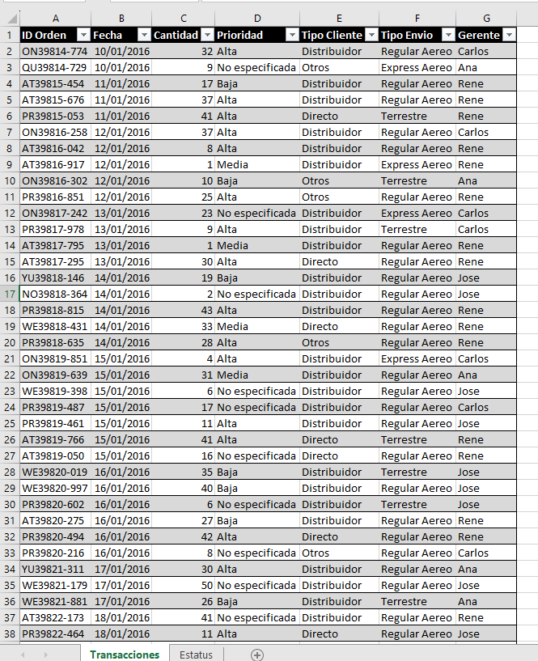
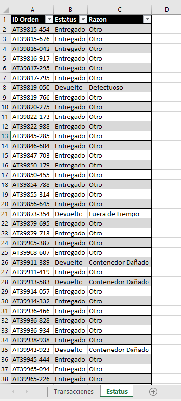
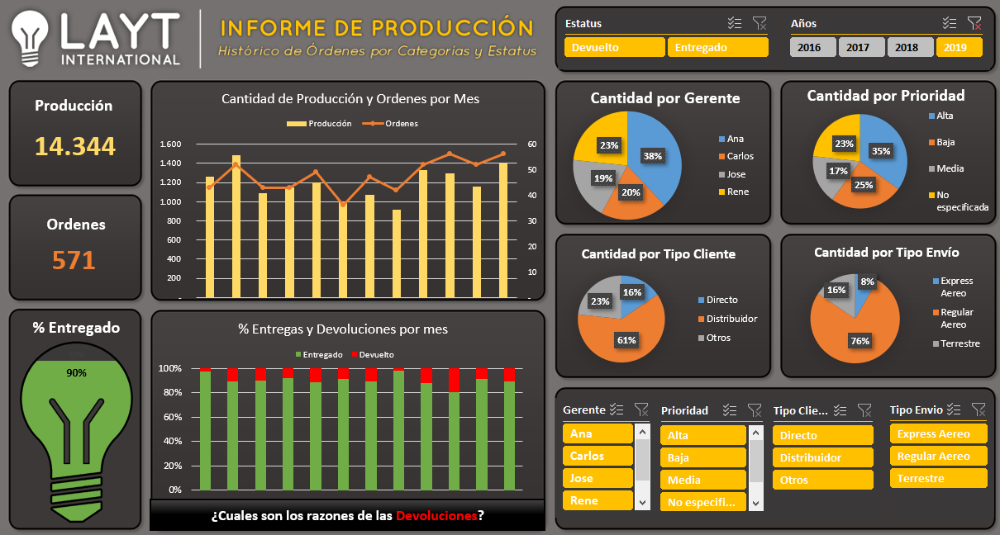
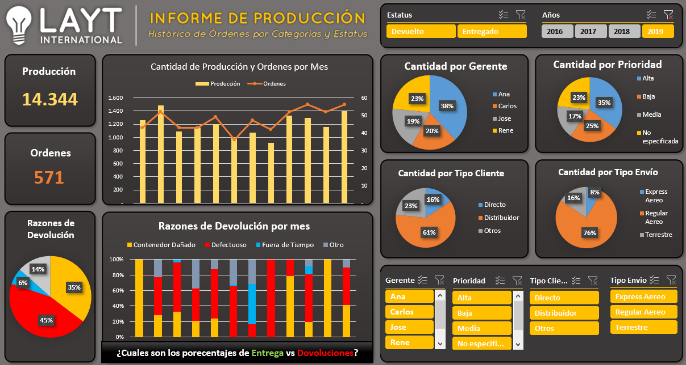

# Dashboard_Produccion
Paneles de Control sobre Producción

## Introducción
Proyecto de una serie de prácticas realizadas con diferentes programas para la realización de Paneles de Control.

Actualmente esta realizado con Excel y Power BI.

[Excel](https://github.com/ntr94/Dashboard_Produccion/blob/main/README.md#excel)

[Power BI](https://github.com/ntr94/Dashboard_Produccion/blob/main/README.md#power-bi)

## Explicación
Este proyecto consiste en obtener un par de Paneles de Control con los datos de Producción disponibles. Estos datos cuenta con dos hojas diferentes con diferentes tablas. 

A partir de estos datos se van realizar dos paneles de control interactivo para la visualización de los datos mostrados.

[Archivo Excel Original](https://github.com/ntr94/Dashboard_Produccion/blob/main/Produccion.xlsx)

## Excel

[Archivo Excel](https://github.com/ntr94/Dashboard_Produccion/blob/main/Excel/Informe_Produccion_Excel.xlsx)

## Power BI

[Archivo Power BI](https://github.com/ntr94/Dashboard_Produccion/blob/main/Power%20BI/Informe_Produccion_PowerBI.pbix)

## Dashboard relacionados

[Ventas](https://github.com/ntr94/Dashboard_Ventas)

[Finanzas](https://github.com/ntr94/Dashboard_Finanzas)
